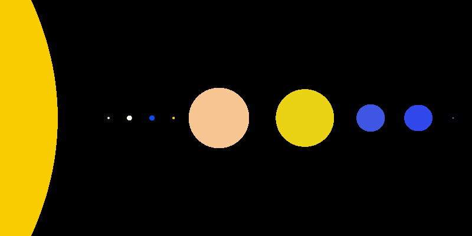

# Project 2 - Raycaster
A simple raycaster (without reflection or refraction) written in C.

This program uses a command line interface and creates images using a CSV file describing the objects in the scene. The program writes the final image in PPM format (P3) and saves it using the given file name.

## Usage
Get a local copy of the repository by downloading the zip or using `git clone`. This includes a makefile which allows you to simply `make` the project as long as you are in a *UNIX-like* environment.

Then, depending on your operating system/environment, you can run the program by using one of the following commands:

```
./raycast.exe 100 100 objects.csv output.ppm
```
```
raycast 100 100 objects.csv output.ppm
```

The first two numbers represent width and height (respectively). `objects.csv` is a CSV file in which each line represents an object (camera, sphere, plane) and its properties (width, height, color, position, radius, normal). Finally, `output.ppm` is the name of the PPM file to be created.

## Examples

### Fringe Case Testing Example


[Example CSV](examples/example.csv) - (width: 400px, height: 400px)

The above example demonstrates **depth**, **multiple spheres**, **multiple planes**, **intersecting planes**, **intersecting spheres**, and **poor CSV spacing**.

### Solar System Example


[Solar System CSV](examples/solar.csv) - (width: 800px, height: 400px)

A representation of our solar system, now with 100% more raycasting!

## Known Issues/Strange Behavior
* None (so far)

## Author
Peter Huettl - [ph289@nau.edu](mailto:ph289@nau.edu)
